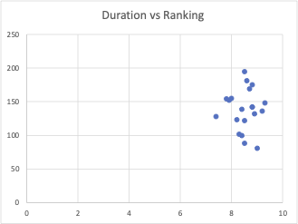

Movie Ratings Analysis
Overview

This project explores a curated dataset of popular films to analyze how movie duration and release year relate to ratings.

The dataset is inspired by publicly available sources such as IMDb, but simplified for exploratory analysis and learning purposes.

Dataset

The dataset contains 20 well-known films, including titles such as The Dark Knight and The Shawshank Redemption.

Feature	Description
Title	Movie name
Genre	Primary genre
Year	Release year
Rating	Average rating (scale: 1–10)
Duration	Length in minutes
Objectives
Analyze whether longer movies receive higher ratings
Evaluate whether newer movies perform better than older ones
Practice exploratory data analysis and visualization
Analysis and Visualizations
Duration vs Rating

Findings:

Movies longer than 128 minutes have a slightly higher median rating (8.75) 
Shorter movies show greater variability in ratings
High-rated movies are present in both groups

There is no clear pattern in the data, indicating a weak relationship between duration and rating.

Release Year vs Rating

Findings:

No clear relationship between release year and rating
Ratings remain relatively stable over time
Older films such as The Godfather achieve some of the highest ratings

This suggests that movie quality is not dependent on release year.

Key Insights
Duration has limited influence on movie ratings
High ratings occur across both short and long films
There is no observable trend linking newer films to higher ratings
Ratings appear independent of both duration and release year
Limitations
Small sample size (20 movies)
Curated dataset rather than full real-world data
Ratings are approximate and not dynamically updated
Limited number of features (no vote counts, revenue, or budget)

These results should be interpreted as exploratory rather than conclusive.

Tools
Excel (data analysis and visualization)
Future Improvements
Expand the dataset using sources such as IMDb or TMDb
Include additional variables:
Number of votes
Budget and revenue
Multiple genres
Apply statistical testing or predictive modeling
movie-ratings-analysis/
├── README.md
├── data/
│   └── movies.csv
├── images/
│   ├── duration_vs_rating.png
│   └── year_vs_rating.png
└── analysis/
    └── movie_analysis.xlsx
Notes
Visualizations are stored in the images folder and embedded in this README
Dataset and analysis files are included for reproducibility
Conclusion

This project demonstrates fundamental exploratory data analysis techniques, including group comparison using median values and visual assessment of relationships between variables.

While the dataset is simplified, the approach reflects practical analytical thinking and clear communication of insights.
